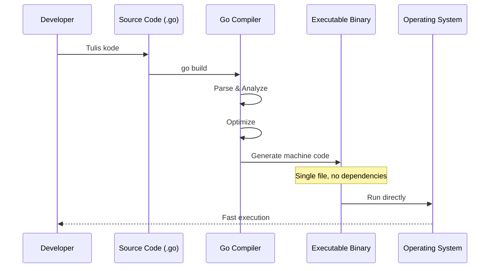
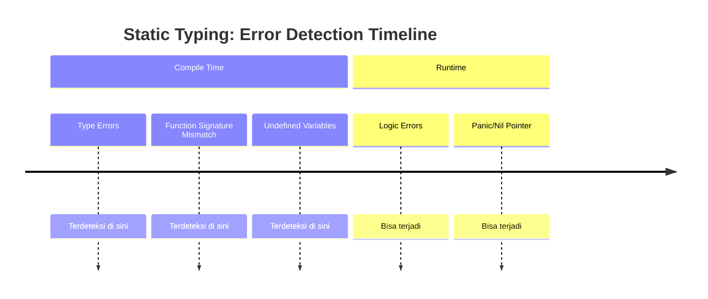
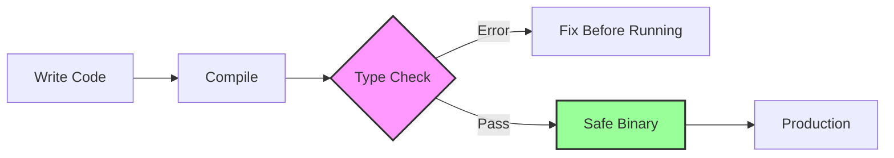
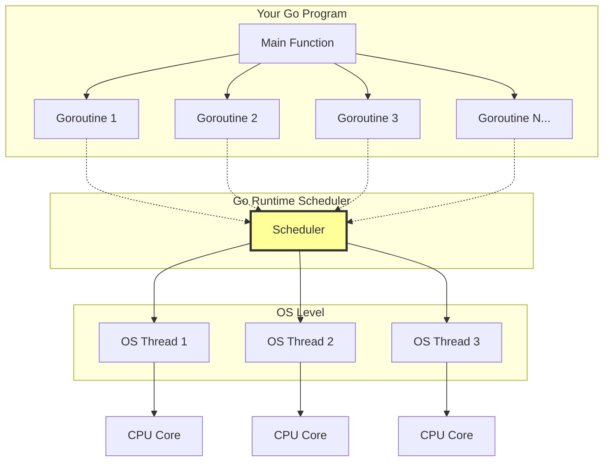
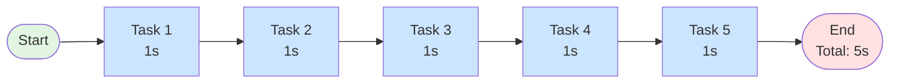
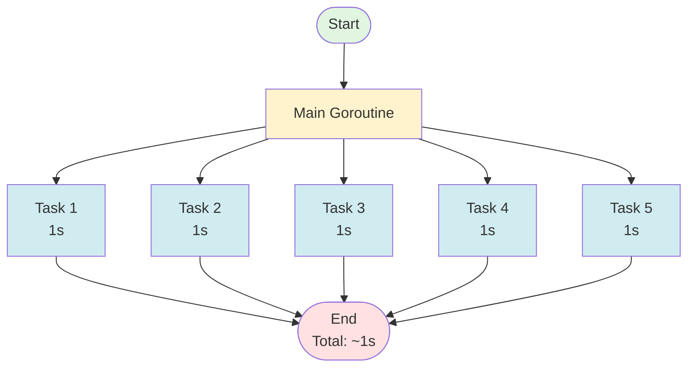
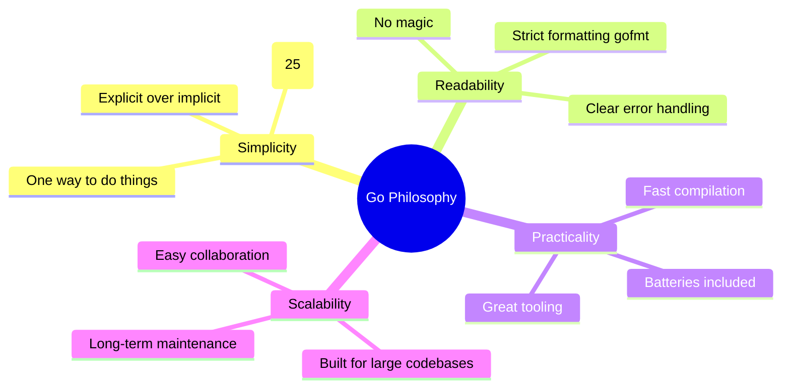
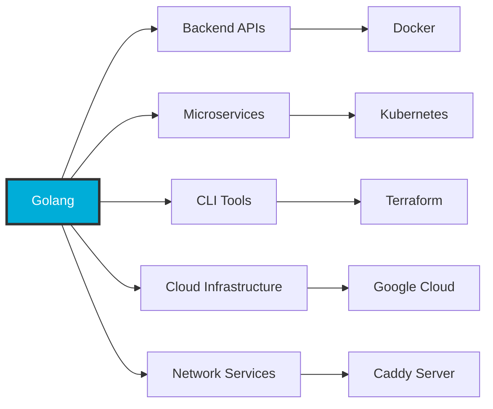
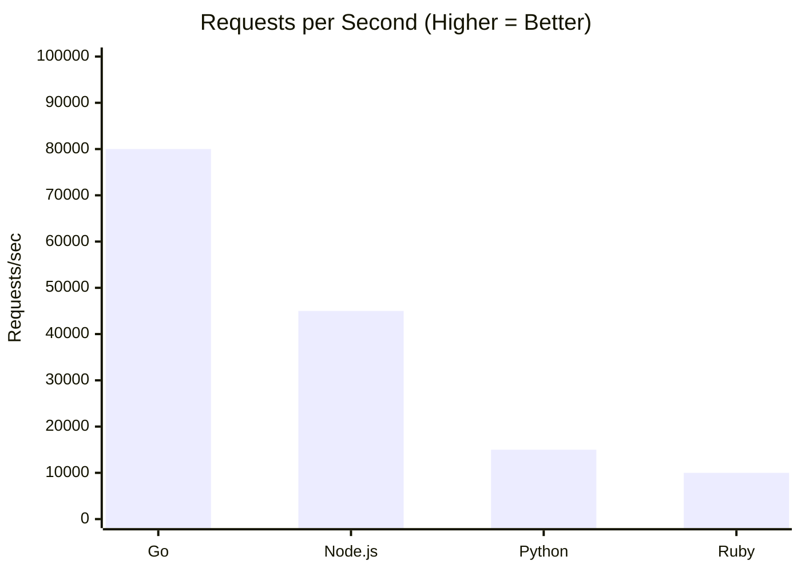

# Pengenalan Golang

Golang, atau Go, adalah bahasa pemrograman yang dirancang sebagai **bahasa compiled**. Artinya, kode yang ditulis oleh developer tidak dijalankan baris demi baris oleh sebuah interpreter, melainkan terlebih dahulu diterjemahkan menjadi sebuah **program biner** yang bisa dieksekusi langsung oleh sistem operasi. Proses kompilasi ini menghasilkan file satu file binary yang sudah berisi seluruh instruksi yang dibutuhkan untuk berjalan. Karena itu, program Go cenderung memiliki waktu startup yang sangat cepat dan performa yang konsisten. Dalam konteks deployment, pendekatan ini juga sangat menguntungkan karena aplikasi cukup didistribusikan dalam bentuk satu file biner tanpa ketergantungan runtime eksternal.

## Compiled Language: Dari Source ke Binary

### Perbandingan: Compiled vs Interpreted

```
flowchart LR

  subgraph I["Interpreted Language (Python / JavaScript)"]
    direction LR
    I_A["Source Code<br/>main.py"] --> I_B["Interpreter"] --> I_C["Execute Line by Line"] --> I_D["Runtime Environment Required"]
  end

  subgraph C["Compiled Language (Go)"]
    direction LR
    C_A["Source Code<br/>main.go"] --> C_B["Go Compiler"] --> C_C["Binary Executable"] --> C_D["Run Directly on OS"]
  end

  %% paksa posisi: I di atas, C di bawah (tanpa node START terlihat)
  I_A ~~~ C_A


```

**Keuntungan Compiled Approach:**

| Aspek | Golang (Compiled) | Python/JS (Interpreted) |
|-------|-------------------|-------------------------|
| Startup Time | Sangat cepat (ms) | Lebih lambat (perlu load interpreter) |
| Deployment | Single binary file | Butuh runtime + dependencies |
| Performance | Konsisten & tinggi | Bergantung pada interpreter |
| Distribution | Copy 1 file | Install runtime + packages |

### Visualisasi Proses Kompilasi



### Contoh Praktis

```go
// main.go
package main

import "fmt"

func main() {
    fmt.Println("Hello, World!")
}
```

```bash
# Kompilasi ke binary
$ go build -o myapp main.go

# Hasilnya: satu file executable
$ ls -lh myapp
-rwxr-xr-x  1 user  staff   2.0M Jan  4 10:00 myapp

# Langsung jalankan tanpa runtime eksternal
$ ./myapp
Hello, World!
```

---

## Sistem Tipe Statis

Selain bersifat compiled, Go juga merupakan bahasa dengan **sistem tipe statis**. Ini berarti setiap variabel, fungsi, dan nilai memiliki tipe yang sudah ditentukan dan diverifikasi pada saat kompilasi, bukan saat program sedang berjalan. Dengan pendekatan ini, banyak kesalahan logika dasar—seperti penggunaan tipe data yang tidak sesuai—dapat dideteksi lebih awal sebelum aplikasi dijalankan. Konsekuensinya, kode Go cenderung lebih aman, lebih dapat diprediksi, dan lebih mudah dirawat dalam jangka panjang, terutama pada basis kode yang besar dan dikerjakan oleh banyak orang.

### Kapan Error Terdeteksi



### Perbandingan: Static vs Dynamic Typing

<div style={{display: 'grid', gridTemplateColumns: '1fr 1fr', gap: '1rem', marginTop: '1rem'}}>

<div>

**Static Typing (Go)**
```go
// Tipe ditentukan di compile time
var age int = 25
var name string = "Alice"

// Error: tipe tidak cocok
// age = "twenty five" // ❌ Won't compile!
```

</div>

<div>

**Dynamic Typing (Python)**
```python
# Tipe ditentukan saat runtime
age = 25
name = "Alice"

# Allowed, tapi bisa bahaya
age = "twenty five"  # ✓ Runtime error nanti
```

</div>

</div>

### Benefit Static Typing



**Keuntungan:**
- **Early Detection**: Bug ketangkep sebelum production
- **Better IDE Support**: Autocomplete & refactoring lebih akurat
- **Self-Documenting**: Tipe data = dokumentasi built-in
- **Maintainability**: Mudah tracking di large codebase

---

## Fokus pada Performa, Concurrency, dan Kesederhanaan

Go dirancang dengan fokus kuat pada **performa**, **concurrency**, dan **kesederhanaan**. Performa dicapai melalui hasil kompilasi ke kode mesin yang efisien serta runtime yang relatif kecil. Namun, keunggulan utama Go bukan hanya pada kecepatan eksekusi, melainkan pada kemampuannya menangani banyak pekerjaan secara bersamaan dengan cara yang sederhana dan aman. Konsep concurrency di Go dibangun langsung ke dalam bahasa, sehingga developer tidak perlu berurusan dengan kompleksitas manajemen thread tingkat rendah. Model ini memungkinkan pembuatan aplikasi yang responsif dan skalabel tanpa menambah beban kognitif yang besar.

### Arsitektur Concurrency Go



### Goroutine vs Traditional Threading

| Aspek | Goroutines (Go) | OS Threads |
|-------|-----------------|------------|
| Memory per unit | ~2KB | ~1-2MB |
| Creation cost | Sangat murah | Mahal |
| Jumlah maksimal | Jutaan | Ribuan |
| Management | Go runtime | OS kernel |
| Switching cost | Rendah | Tinggi |

### Contoh Sederhana Concurrency

```go
package main

import (
    "fmt"
    "time"
)

func task(id int) {
    fmt.Printf("Task %d started\n", id)
    time.Sleep(1 * time.Second)
    fmt.Printf("Task %d completed\n", id)
}

func main() {
    // Jalankan 5 tasks secara concurrent
    for i := 1; i <= 5; i++ {
        go task(i) // Keyword 'go' = buat goroutine baru
    }

    // Wait agar main tidak langsung exit
    time.Sleep(2 * time.Second)
}
```

**Output:** Semua tasks jalan bersamaan, bukan sequential!

```
Task 1 started
Task 2 started
Task 3 started
Task 4 started
Task 5 started
Task 1 completed
Task 3 completed
Task 2 completed
Task 5 completed
Task 4 completed
```

### Visualisasi Execution

**Sequential Execution:**


**Concurrent Execution (Goroutines):**


**Sequential:** Tasks jalan satu per satu → Total waktu = 5 detik
**Concurrent:** Semua tasks jalan bersamaan → Total waktu = ~1 detik

---

## Filosofi Kesederhanaan

Kesederhanaan menjadi prinsip utama dalam desain Go. Bahasa ini sengaja membatasi jumlah fitur dan sintaks yang "terlalu pintar" agar kode tetap mudah dibaca dan dipahami. Filosofi ini lahir dari kebutuhan dunia industri, di mana kode lebih sering dibaca dan dipelihara daripada ditulis ulang. Dengan aturan yang jelas dan gaya penulisan yang konsisten, Go mendorong developer untuk menulis kode yang eksplisit, mudah ditelusuri, dan minim kejutan.

### Prinsip Desain Go



### Contoh: Explicit Error Handling

<div style={{display: 'grid', gridTemplateColumns: '1fr 1fr', gap: '1rem'}}>

<div>

**Go (Explicit)**
```go
file, err := os.Open("data.txt")
if err != nil {
    log.Fatal(err)
    return
}
defer file.Close()

// Pasti aman sampai sini
// Kita tau error udah di-handle
```

</div>

<div>

**Other Languages (Implicit)**
```javascript
// JavaScript - bisa lupa catch
const file = fs.readFileSync("data.txt")
// Langsung crash kalau error

// Exception bisa dari mana aja
// Susah tracking error flow
```

</div>

</div>

**Keuntungan Explicit Approach:**
- Error handling terlihat jelas di kode
- Tidak ada "surprise exception" dari nested function
- Mudah trace error flow
- Code reviewer bisa langsung lihat edge cases

---

## Area Penggunaan Golang

Karena karakteristik tersebut, Go sangat kuat digunakan untuk pengembangan **backend**, **microservices**, **command-line tools**, **sistem jaringan**, dan **aplikasi terdistribusi**. Pada sistem-sistem ini, kecepatan eksekusi, efisiensi resource, kemudahan deployment, dan keamanan concurrency menjadi kebutuhan utama. Go dirancang secara spesifik untuk menjawab kebutuhan tersebut, bukan sebagai bahasa serba bisa untuk semua jenis aplikasi, melainkan sebagai alat yang solid untuk membangun sistem yang besar, stabil, dan tahan lama.

### Use Cases & Companies



### Kenapa Go Cocok untuk Domain Ini?

| Kebutuhan | Solusi Go |
|-----------|-----------|
| **High throughput** | Compiled, efficient runtime |
| **Handle banyak koneksi** | Lightweight goroutines |
| **Quick deployment** | Single binary, no dependencies |
| **System reliability** | Static typing, early error detection |
| **Team scalability** | Simple syntax, strict formatting |
| **Resource efficiency** | Low memory footprint |

### Real-World Example: Web Server Performance

```go
// Web server yang bisa handle ribuan koneksi concurrent
package main

import (
    "fmt"
    "net/http"
)

func handler(w http.ResponseWriter, r *http.Request) {
    fmt.Fprintf(w, "Hello from Go!")
}

func main() {
    http.HandleFunc("/", handler)

    // Setiap request otomatis jalan di goroutine terpisah
    // Bisa handle thousands of concurrent requests
    http.ListenAndServe(":8080", nil)
}
```

**Benchmark Comparison:**



---

## Langkah Selanjutnya

Di bagian berikutnya kita akan mendalami:

1. **Concurrency Model** - Goroutines, channels, dan pola-pola concurrent programming
2. **Runtime Scheduler** - Bagaimana Go runtime mengatur goroutines secara internal
3. **Praktik Koding** - Hands-on writing actual Go programs

Setiap konsep akan dijelaskan dengan pendekatan yang sama: konsep dulu, visualisasi, baru praktik kode.

---

**Key Takeaways:**

- Go adalah compiled language → performa tinggi, deployment mudah
- Static typing → error tertangkap lebih awal, kode lebih aman
- Concurrency built-in → goroutines ringan untuk handle banyak tasks
- Filosofi sederhana → kode mudah dibaca, dipelihara, dan diskala
- Cocok untuk system programming → backend, microservices, cloud infrastructure
