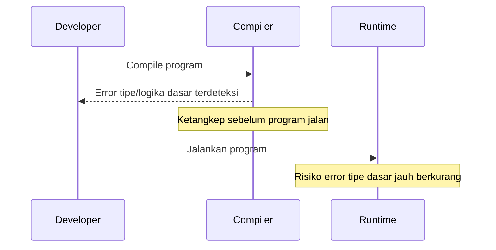
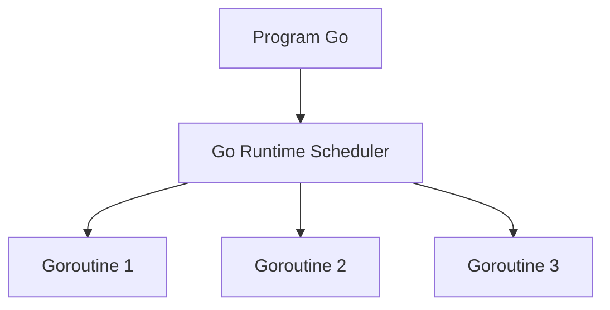

# Pengenalan Golang

Golang, atau Go, adalah bahasa pemrograman yang dirancang sebagai **bahasa compiled**. Artinya, kode yang ditulis oleh developer tidak dijalankan baris demi baris oleh sebuah interpreter, melainkan terlebih dahulu diterjemahkan menjadi sebuah **program biner** yang bisa dieksekusi langsung oleh sistem operasi.

Proses kompilasi ini menghasilkan file mandiri yang sudah berisi seluruh instruksi yang dibutuhkan untuk berjalan. Karena itu, program Go cenderung memiliki waktu mulai yang sangat cepat dan performa yang konsisten. Dalam konteks deployment, pendekatan ini juga sangat menguntungkan karena aplikasi cukup didistribusikan dalam bentuk satu file biner tanpa ketergantungan runtime eksternal.

---

## Compiled Language: Dari Source ke Binary

Secara konseptual, alur dari source code sampai bisa dieksekusi dapat digambarkan seperti ini:

```mermaid
flowchart LR
  A[Source Code (.go)] --> B[Go Compiler]
  B --> C[Single Binary File]
  C --> D[Operating System]
```

Developer menulis source code `.go`, lalu compiler Go menerjemahkannya menjadi satu file biner. File ini dapat langsung dijalankan oleh sistem operasi tanpa perlu interpreter atau virtual machine tambahan.

Pendekatan ini membuat deployment jadi “ringkas”: cukup satu file biner, konfigurasi minim, dan relatif bebas dari masalah kompatibilitas runtime.

---

## Sistem Tipe Statis

Selain bersifat compiled, Go juga merupakan bahasa dengan **sistem tipe statis**. Ini berarti setiap variabel, fungsi, dan nilai memiliki tipe yang sudah ditentukan dan diverifikasi pada saat kompilasi, bukan saat program sedang berjalan.

Dengan pendekatan ini, banyak kesalahan logika dasar—seperti penggunaan tipe data yang tidak sesuai—dapat dideteksi lebih awal sebelum aplikasi dijalankan. Konsekuensinya, kode Go cenderung lebih aman, lebih dapat diprediksi, dan lebih mudah dirawat dalam jangka panjang, terutama pada basis kode yang besar dan dikerjakan oleh banyak orang.

Berikut gambaran kapan error biasanya “ketangkep”:



---

## Fokus pada Performa dan Concurrency

Go dirancang dengan fokus kuat pada **performa**, **concurrency**, dan **kesederhanaan**.

Performa dicapai melalui hasil kompilasi ke kode mesin yang efisien serta runtime yang relatif kecil. Namun, keunggulan utama Go bukan hanya pada kecepatan eksekusi, melainkan pada kemampuannya menangani banyak pekerjaan secara bersamaan dengan cara yang sederhana dan aman.

Konsep concurrency di Go dibangun langsung ke dalam bahasa, sehingga developer tidak perlu berurusan dengan kompleksitas manajemen thread tingkat rendah.

Gambaran sederhananya:



Runtime Go mengatur penjadwalan goroutine, sehingga developer bisa fokus pada struktur logika aplikasi: membagi pekerjaan, mengatur komunikasi, dan menghindari bottleneck.

---

## Filosofi Kesederhanaan

Kesederhanaan menjadi prinsip utama dalam desain Go. Bahasa ini sengaja membatasi jumlah fitur dan sintaks yang “terlalu pintar” agar kode tetap mudah dibaca dan dipahami.

Filosofi ini lahir dari kebutuhan dunia industri, di mana kode lebih sering dibaca dan dipelihara daripada ditulis ulang. Dengan aturan yang jelas dan gaya penulisan yang konsisten, Go mendorong developer untuk menulis kode yang eksplisit, mudah ditelusuri, dan minim kejutan.

---

## Area Penggunaan Golang

Karena karakteristik tersebut, Go sangat kuat digunakan untuk pengembangan:

- Backend
- Microservices
- Command-line tools
- Sistem jaringan
- Aplikasi terdistribusi

Di domain-domain ini, kecepatan eksekusi, efisiensi resource, kemudahan deployment, dan keamanan concurrency jadi kebutuhan utama. Go dirancang secara spesifik untuk menjawab kebutuhan tersebut: membangun sistem yang besar, stabil, dan tahan lama.

---

## Langkah Selanjutnya

Di bagian berikutnya kita bisa lanjut (tetap gaya buku):

- Apa itu **concurrency** di Go dan kenapa beda dengan bahasa lain
- Cara Go mengatur **runtime scheduler** dan **goroutine** secara konseptual
- Baru setelah itu masuk ke praktik kode secara bertahap
