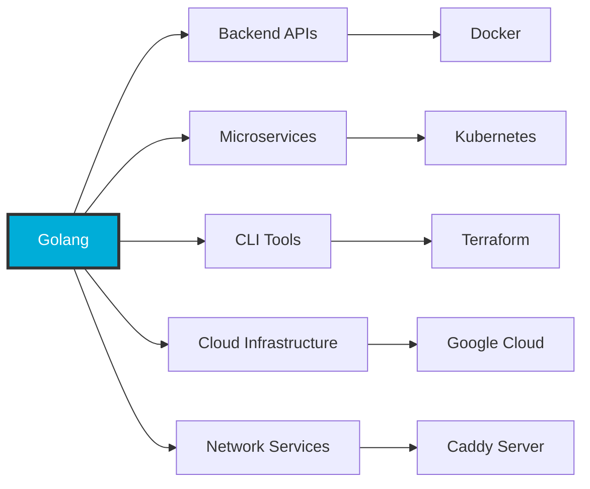
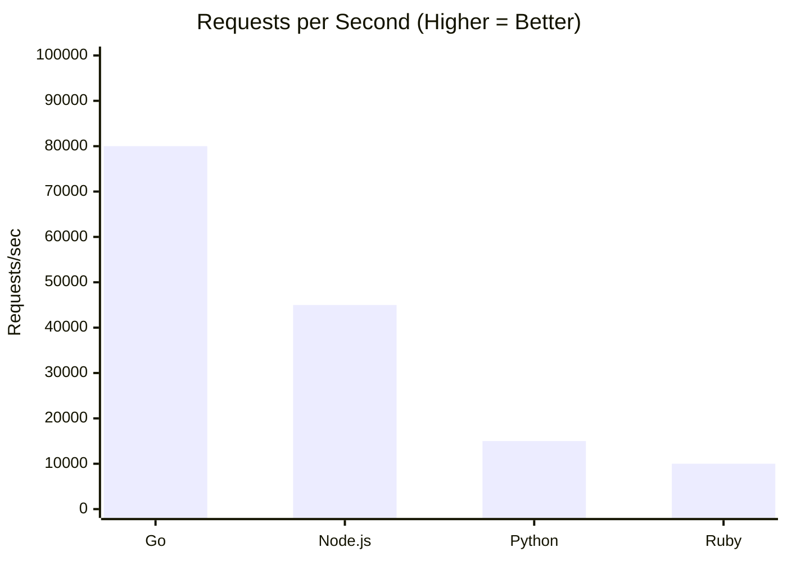

# Pengenalan Golang

Golang, atau Go, adalah bahasa pemrograman yang dirancang sebagai **bahasa compiled**. Artinya, kode yang ditulis oleh developer tidak dijalankan baris demi baris oleh sebuah interpreter, melainkan terlebih dahulu diterjemahkan menjadi sebuah **program biner** yang bisa dieksekusi langsung oleh sistem operasi. Proses kompilasi ini menghasilkan file satu file binary yang sudah berisi seluruh instruksi yang dibutuhkan untuk berjalan. Karena itu, program Go cenderung memiliki waktu startup yang sangat cepat dan performa yang konsisten. Dalam konteks deployment, pendekatan ini juga sangat menguntungkan karena aplikasi cukup didistribusikan dalam bentuk satu file biner tanpa ketergantungan runtime eksternal.

## Compiled Language: Dari Source ke Binary

Pada bahasa pemrograman bertipe compiled seperti Golang, kode sumber tidak dijalankan secara langsung, melainkan terlebih dahulu diterjemahkan oleh compiler menjadi sebuah file biner. File biner ini berisi instruksi mesin yang dapat dieksekusi langsung oleh sistem operasi tanpa memerlukan interpreter atau runtime tambahan. Karena proses penerjemahan telah selesai sebelum program dijalankan, aplikasi hasil kompilasi umumnya memiliki waktu startup yang cepat, performa yang konsisten, serta lebih mudah didistribusikan dalam bentuk satu file binary yang dapat langsung di jalankan.

### Perbandingan: Compiled vs Interpreted


**Keuntungan Compiled Approach:**

| Aspek | Golang (Compiled) | Python/JS (Interpreted) |
|-------|-------------------|-------------------------|
| Startup Time | Sangat cepat (ms) | Lebih lambat (perlu load interpreter) |
| Deployment | Single binary file | Butuh runtime + dependencies |
| Performance | Konsisten & tinggi | Bergantung pada interpreter |
| Distribution | Copy 1 file | Install runtime + packages |

### Visualisasi Proses Kompilasi


### Contoh Praktis

```go
// main.go
package main

import "fmt"

func main() {
    fmt.Println("Hello, World!")
}
```

```bash
# Kompilasi ke binary
$ go build -o myapp main.go

# Hasilnya: satu file executable
$ ls -lh myapp
-rwxr-xr-x  1 user  staff   2.0M Jan  4 10:00 myapp

# Langsung jalankan tanpa runtime eksternal
$ ./myapp
Hello, World!
```

---

## Static Typing

Selain bersifat compiled, Go juga merupakan bahasa dengan **Static Typing**. Ini berarti setiap variabel, fungsi, dan nilai memiliki tipe yang sudah ditentukan dan diverifikasi pada saat kompilasi, bukan saat program sedang berjalan. Dengan pendekatan ini, banyak kesalahan logika dasar—seperti penggunaan tipe data yang tidak sesuai—dapat dideteksi lebih awal sebelum aplikasi dijalankan. Manfaatnya, kode Go cenderung lebih aman, lebih dapat diprediksi, dan lebih mudah dimaintenance dalam jangka panjang, terutama pada basis kode yang besar dan dikerjakan oleh banyak orang.


### Perbandingan: Static vs Dynamic Typing

<div style={{display: 'grid', gridTemplateColumns: '1fr 1fr', gap: '1rem', marginTop: '1rem'}}>

<div>

**Static Typing (Go)**
```go
// Tipe ditentukan di compile time
var age int = 25
var name string = "Alice"

// Error: tipe tidak cocok
// age = "twenty five" // ❌ Won't compile!
```

</div>

<div>

**Dynamic Typing (Python)**
```python
# Tipe ditentukan saat runtime
age = 25
name = "Alice"

# Allowed, tapi bisa bahaya
age = "twenty five"  # ✓ Runtime error nanti
```

</div>

</div>


---

## Fokus pada Performa, Concurrency, dan Kesederhanaan

Go dirancang dengan fokus kuat pada **performa**, **concurrency**, dan **kesederhanaan**. Performa dicapai melalui hasil kompilasi ke kode mesin yang efisien serta runtime yang relatif kecil. Keunggulan utama Go bukan hanya pada kecepatan eksekusi, melainkan pada kemampuannya menangani banyak pekerjaan secara bersamaan dengan cara yang sederhana dan aman. Konsep concurrency di Go dibangun langsung ke dalam bahasa go itu sendiri, sehingga developer tidak perlu berurusan dengan kompleksitas manajemen low level thread. Model ini memungkinkan pembuatan aplikasi yang responsif dan skalabel tanpa menambah beban kognitif yang besar.

### Arsitektur Concurrency Go


### Goroutine vs Traditional Threading

| Aspek | Goroutines (Go) | OS Threads |
|-------|-----------------|------------|
| Memory per unit | ~2KB | ~1-2MB |
| Creation cost | Sangat murah | Mahal |
| Jumlah maksimal | Jutaan | Ribuan |
| Management | Go runtime | OS kernel |
| Switching cost | Rendah | Tinggi |

### Contoh Sederhana Concurrency

```go
package main

import (
    "fmt"
    "time"
)

func task(id int) {
    fmt.Printf("Task %d started\n", id)
    time.Sleep(1 * time.Second)
    fmt.Printf("Task %d completed\n", id)
}

func main() {
    // Jalankan 5 tasks secara concurrent
    for i := 1; i <= 5; i++ {
        go task(i) // Keyword 'go' = buat goroutine baru
    }

    // Wait agar main tidak langsung exit
    time.Sleep(2 * time.Second)
}
```

**Output:** Semua tasks jalan bersamaan.

```
Task 1 started
Task 2 started
Task 3 started
Task 4 started
Task 5 started
Task 1 completed
Task 3 completed
Task 2 completed
Task 5 completed
Task 4 completed
```

**Sequential Execution:**

**Sequential execution** menjalankan tugas secara berurutan, di mana setiap tugas harus selesai sebelum tugas berikutnya dimulai. Dengan pendekatan ini, total waktu eksekusi merupakan akumulasi dari durasi seluruh tugas, sehingga pada contoh ini mencapai 5 detik.

**Concurrent Execution (Goroutines):**
.png?raw=true)
**Concurrent execution** memungkinkan beberapa tugas dijalankan secara bersamaan dalam satu rentang waktu eksekusi. Selama tugas-tugas tersebut dapat diproses secara paralel atau saling menunggu secara non-blok, total waktu eksekusi dapat ditekan mendekati durasi tugas terlama, yaitu sekitar 1 detik.

---

## Go Philosophy

Kesesederhanaan merupakan dasar utama dalam perancangan bahasa pemrograman Go. Bahasa ini dibuat dengan tujuan agar kode yang ditulis dapat dibaca dan dipahami dengan cepat, bahkan oleh pengembang lain yang belum pernah melihat kode tersebut sebelumnya. Oleh karena itu, Go secara sengaja menghindari sintaks yang kompleks dan fitur yang menyembunyikan perilaku program di balik abstraksi yang tidak terlihat secara langsung.

Dalam Go, alur program ditulis secara eksplisit. Penanganan error dilakukan secara jelas, tanpa mekanisme otomatis yang tersembunyi. Setiap proses yang terjadi di dalam program dapat ditelusuri langsung dari kode sumbernya. Pendekatan ini memudahkan pengembang untuk memahami apa yang dilakukan oleh sebuah program, bagaimana kesalahan ditangani, dan bagaimana data mengalir dari satu bagian ke bagian lainnya.

Dengan aturan penulisan yang konsisten dan format kode yang distandarkan, Go membantu menjaga keseragaman gaya dalam sebuah codebase. Hal ini sangat penting pada proyek berskala besar, di mana banyak pengembang bekerja bersama dan kode terus berkembang dalam jangka waktu yang panjang. Melalui kesederhanaan ini, Go mendorong penulisan kode yang mudah dibaca, mudah dirawat, dan dapat dikembangkan secara berkelanjutan.


<div style={{display: 'grid', gridTemplateColumns: '1fr 1fr', gap: '1rem'}}>

<div>

**Go (Explicit)**
```go
file, err := os.Open("data.txt")
if err != nil {
    log.Fatal(err)
    return
}
defer file.Close()

// Pasti aman sampai sini
// Kita tau error udah di-handle
```

</div>

<div>

**Other Languages (Implicit)**
```javascript
// JavaScript - bisa lupa catch
const file = fs.readFileSync("data.txt")
// Langsung crash kalau error

// Exception bisa dari mana aja
// Susah tracking error flow
```

</div>

</div>

**Keuntungan Explicit Approach:**

Pada Go, penanganan error ditulis secara eksplisit dan menjadi bagian dari alur logika program. Ketika sebuah operasi berpotensi gagal, seperti membuka file, hasil operasi tersebut selalu disertai nilai error yang harus diperiksa secara langsung. Dengan cara ini, pengembang dipaksa untuk menyadari kemungkinan kegagalan sejak awal dan menentukan dengan jelas apa yang harus dilakukan ketika error terjadi. Setelah error ditangani, alur program dapat dilanjutkan dengan kepastian bahwa kondisi yang berbahaya telah diantisipasi.

Pendekatan ini berbeda dengan bahasa yang mengandalkan mekanisme exception secara implisit. Pada model tersebut, sebuah error dapat muncul dari dalam fungsi yang dipanggil tanpa terlihat langsung pada kode pemanggilnya. Jika tidak ditangani dengan benar, exception dapat menyebabkan program berhenti secara tiba-tiba, dan alur kesalahan menjadi sulit ditelusuri karena berpindah lintas fungsi dan konteks eksekusi. Akibatnya, pengembang sering kali harus melacak kembali sumber error melalui stack trace yang panjang.

Dengan menempatkan penanganan error secara eksplisit di setiap langkah penting, Go membuat alur kegagalan program terlihat jelas dari atas ke bawah. Pembaca kode dapat langsung memahami pada bagian mana program bisa gagal, bagaimana kegagalan tersebut ditangani, dan kondisi apa yang dijamin aman setelahnya. Inilah yang menjadikan kode Go relatif mudah ditinjau, diuji, dan dipelihara, terutama pada sistem yang kompleks dan berkembang dalam jangka panjang.

---

## Area Penggunaan Golang

Karena karakteristik tersebut, Go sangat kuat digunakan untuk pengembangan **backend**, **microservices**, **command-line tools**, **sistem jaringan**, dan **aplikasi terdistribusi**. Pada sistem-sistem ini, kecepatan eksekusi, efisiensi resource, kemudahan deployment, dan keamanan concurrency menjadi kebutuhan utama. Go dirancang secara spesifik untuk menjawab kebutuhan tersebut, bukan sebagai bahasa serba bisa untuk semua jenis aplikasi, melainkan sebagai alat yang solid untuk membangun sistem yang besar, stabil, dan tahan lama.

### Use Cases & Companies



### Kenapa Go Cocok untuk Domain Ini?

Go dirancang untuk membangun sistem backend dan layanan jaringan yang membutuhkan performa tinggi dan stabilitas jangka panjang. Sebagai bahasa compiled, Go menghasilkan program biner yang dapat dieksekusi langsung oleh sistem operasi, sehingga mampu menangani lalu lintas tinggi dengan overhead yang minimal. Dukungan concurrency melalui goroutine memungkinkan aplikasi menangani banyak koneksi secara efisien tanpa kompleksitas manajemen thread manual.

Selain itu, proses deployment Go sangat sederhana karena aplikasi didistribusikan sebagai satu file biner tanpa ketergantungan runtime tambahan. Dengan sistem tipe statis dan aturan penulisan kode yang konsisten, Go membantu mendeteksi kesalahan lebih awal dan menjaga codebase tetap mudah dipahami serta dirawat, menjadikannya pilihan yang kuat untuk sistem backend, microservices, dan aplikasi terdistribusi.

### Real-World Example: Web Server Performance

```go
// Web server yang bisa handle ribuan koneksi concurrent
package main

import (
    "fmt"
    "net/http"
)

func handler(w http.ResponseWriter, r *http.Request) {
    fmt.Fprintf(w, "Hello from Go!")
}

func main() {
    http.HandleFunc("/", handler)

    // Setiap request otomatis jalan di goroutine terpisah
    // Bisa handle thousands of concurrent requests
    http.ListenAndServe(":8080", nil)
}
```

**Benchmark Comparison:**



---

## Langkah Selanjutnya

Pada bagian berikutnya, pembahasan akan difokuskan pada **dasar-dasar bahasa Go**, yang meliputi:

1. **Struktur Program Go**  
   Pengenalan `package`, `import`, fungsi `main`, serta alur eksekusi program Go.

2. **Variabel dan Konstanta**  
   Cara mendeklarasikan variabel, *type inference*, penggunaan konstanta, dan konsep scope.

3. **Tipe Data Dasar**  
   Tipe numerik, boolean, string, serta perbedaan antara *value* dan *reference*.

4. **Kontrol Alur Program**  
   Percabangan menggunakan `if` dan `switch`, serta perulangan dengan `for`.

5. **Fungsi**  
   Parameter, nilai balik (*return value*), *multiple return*, dan fungsi sebagai unit logika program.

6. **Error Handling**  
   Pola penanganan error secara eksplisit menggunakan tipe `error`.

7. **Struktur Data Dasar**  
   Penggunaan array, slice, map, dan struct untuk mengelola data.

8. **Pointer Dasar**  
   Konsep pointer dan penggunaannya dalam bahasa Go.

Materi-materi ini akan menjadi fondasi sebelum masuk ke topik lanjutan seperti concurrency, runtime, dan sistem terdistribusi.

---


**Key Takeaways:**

- Go adalah compiled language → performa tinggi, deployment mudah
- Static typing → error tertangkap lebih awal, kode lebih aman
- Concurrency built-in → goroutines ringan untuk handle banyak tasks
- Filosofi sederhana → kode mudah dibaca, dipelihara, dan diskala
- Cocok untuk system programming → backend, microservices, cloud infrastructure
